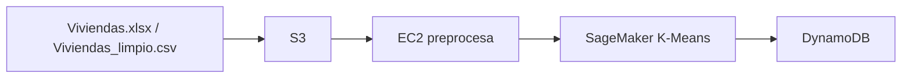

# Pipeline AWS — Clustering de Viviendas con K-Means
**Autor / Author:** Rodolfo Villarreal Rivera (`rodriveracr`)

## Español

### Qué hace
Este proyecto agrupa viviendas similares con K-Means y guarda el resultado en AWS. El flujo original usa S3, EC2, SageMaker y DynamoDB. También incluye una ejecución local con `local_run.py` y un notebook de análisis de clusters.

### Arquitectura



### Archivos clave

| Archivo | Propósito |
|---|---|
| `pipeline.py` | Pipeline principal con CLI (`--role-arn`, `--upload-only`, `--skip-sagemaker`) |
| `upload_and_run.py` | Sube el CSV a S3 y ejecuta el pipeline |
| `launch_ec2.py` | Lanza EC2 para correr el flujo |
| `ec2_userdata.sh` | Bootstrap de la instancia EC2 |
| `local_run.py` | Ejecución local del K-Means con scikit-learn |
| `cluster_analysis.ipynb` | Notebook con visualizaciones de clusters |
| `requirements.txt` | Dependencias del proyecto |
| `RUN_LOCAL.md` | Pasos para ejecutar localmente |

### Ejecución local

```powershell
python -m venv .venv
.\.venv\Scripts\Activate.ps1
pip install -r requirements.txt
python local_run.py
```

### Notebook de análisis
Abre `cluster_analysis.ipynb` y selecciona el kernel `Python (Pipeline AWS)`.

### Requisitos AWS
1. Cuenta AWS con permisos para S3, EC2, SageMaker y DynamoDB.
2. Rol IAM compatible con SageMaker, por ejemplo `EC2SageMakerPipelineRole`.
3. `aws configure` listo si vas a ejecutar en AWS.

### Estructura en S3

```text
s3://rodriveracr-viviendas-pipeline/
├── viviendas/
│   ├── raw/
│   ├── processed/
│   ├── model/
│   └── inference/
└── logs/
```

## English

### What it does
This project clusters similar houses using K-Means and stores the results in AWS. The original pipeline uses S3, EC2, SageMaker, and DynamoDB. It also includes a local runner (`local_run.py`) and a cluster analysis notebook.

### Key files

| File | Purpose |
|---|---|
| `pipeline.py` | Main pipeline with CLI flags (`--role-arn`, `--upload-only`, `--skip-sagemaker`) |
| `upload_and_run.py` | Uploads the CSV to S3 and runs the pipeline |
| `launch_ec2.py` | Launches EC2 for the workflow |
| `ec2_userdata.sh` | EC2 bootstrap script |
| `local_run.py` | Local K-Means run using scikit-learn |
| `cluster_analysis.ipynb` | Notebook with cluster visualizations |
| `requirements.txt` | Project dependencies |
| `RUN_LOCAL.md` | Local run instructions |

### Local run

```powershell
python -m venv .venv
.\.venv\Scripts\Activate.ps1
pip install -r requirements.txt
python local_run.py
```

### Notebook
Open `cluster_analysis.ipynb` and select the `Python (Pipeline AWS)` kernel.

### AWS requirements
1. AWS account with S3, EC2, SageMaker, and DynamoDB permissions.
2. A SageMaker-compatible IAM role, for example `EC2SageMakerPipelineRole`.
3. `aws configure` completed if you want to run in AWS.

---

*Project maintained for rodriveracr — Rodolfo Villarreal Rivera*
